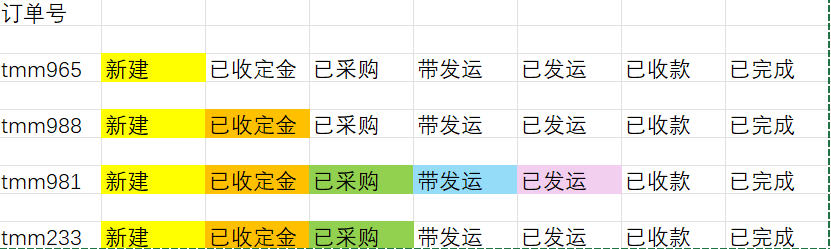

订单状态报表AI提示词
请生成一个订单状态报表，核心要求如下，需严格遵循所有约束，确保输出符合预期：
1.  报表核心组成：包含横向柱状图 ，整体为HTML格式，使用ECharts图表库开发，可直接打开运行，无需复杂依赖。

2.  横向柱状图要求：横轴表示订单状态，纵轴表示未完成的订单号；所有订单状态，按照销售订单状态。必须全部显示，无状态遗漏（无数据状态柱状图高度为0，仍显示状态名称）；颜色区分：已完成状态柱状图为彩色（推荐蓝色#5470c6，可适配视觉规范调整），所有未完成状态柱状图为灰色（推荐#cccccc）；鼠标悬浮柱状图显示tooltip提示，包含状态名称和对应订单数量。

3.  界面与兼容性：整体布局自上而下为“横向柱状图”，简洁无冗余；图表标题为“未完订单状态图”，居中显示；图表宽度100%、高度不低于600px；支持Chrome、Edge、Firefox主流浏览器直接打开，无需额外插件。

4. 报表的目的是快速查看所有未完成订单的状态
