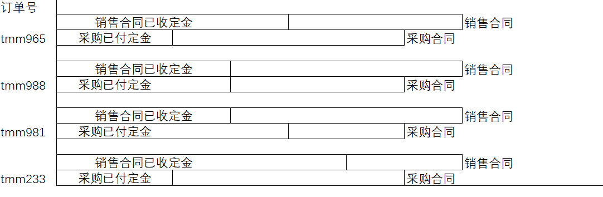

订单状态报表AI提示词
请生成一个订单状态报表，核心要求如下，需严格遵循所有约束，确保输出符合预期：
1.  报表核心组成：包含横向柱状图 ，整体为HTML格式，使用ECharts图表库开发，可直接打开运行，无需复杂依赖。

2.  横向柱状图要求：横纵坐标如图，纵坐标与未完成订单状态一览 的纵坐标一样，

3.  界面与兼容性：整体布局自上而下为“横向柱状图”，简洁无冗余；图表标题为“未完订单资金图”，居中显示；图表宽度100%、高度不低于600px；支持Chrome、Edge、Firefox主流浏览器直接打开，无需额外插件。

4. 报表的目的是快速查看所有未完成订单的资金状态
